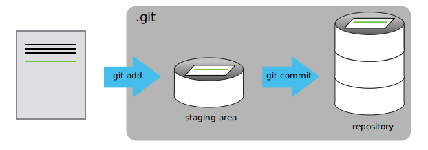

| [⬅ 4. Exploring history](04-exploring-history.md) | [Table of Contents](00-contents.md) |  [6. Setting up a remote repository in GitHub ➡](06-remotes-in-github.md) |
| :---- |:----:| ----:|

# 5. Branches

Now we'll learn about git's "killer feature."

Suppose you
"Some people refer to Git’s branching model as its 'killer feature,' and it certainly sets Git apart in the version control community." Unlike other version control systems, Git doesn't actually save changes, but rather full snapshots at each commit step, although it saves disk space by substituting storage pointers for any unchanged files. "When you make a commit, Git stores a commit object that contains a pointer to the snapshot of the content... If you make some changes and commit again, the next commit stores a pointer to the commit that came immediately before it... A branch in Git is simply a lightweight movable pointer to one of these commits. The default branch name in Git is 'master'. As you start making commits, you’re given a master branch that points to the last commit you made. Every time you commit, it moves forward automatically... What happens if you create a new branch? Doing so creates a new pointer for you to move around."

If you create a branch called 'testing' to develop a new feature in your code and switch to the testing branch (in Git-speak, "check it out"), then new commits will move the testing pointer forward instead of the master pointer. Meanwhile you might learn you need to make an urgent change in the master branch -- no problem, you can just take a break from working on 'testing' to check out the master branch and make the urgent change, then commit it and go back to working on the testing branch. Collaborators can work on different branches in the same code development project. After a while each branch contains commits that aren't in the other branches. Git's "merge" command will combine branches into master intelligently, checking for incompatibilities and asking you to fix them.

