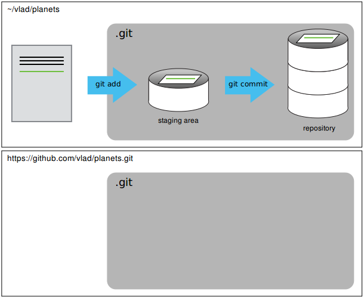
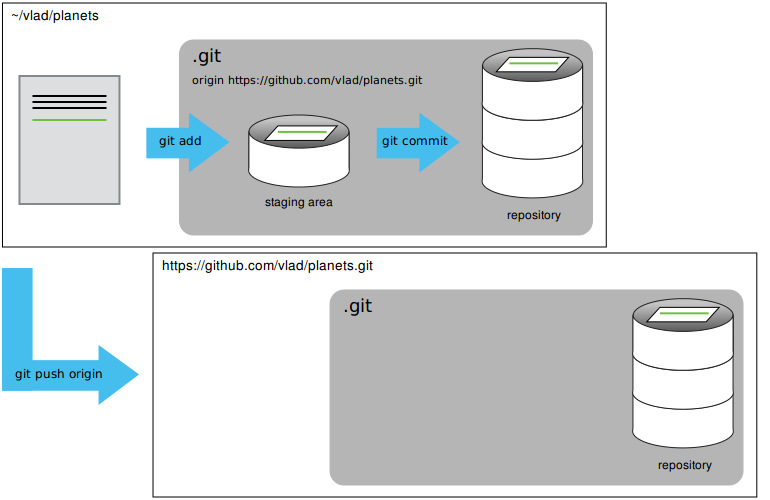

| [⬅ 5. Working with branches](05-branches.md)| [Table of Contents](00-contents.md) | [7. Collaborating ➡](07-collaborating.md) |
| :---- |:----:| ----:|

# 6. Remotes in GitHub

Version control really comes into its own when we begin to collaborate with
other people.  We already have most of the machinery we need to do this; the
only thing missing is to copy changes from one repository to another.

Systems like Git allow us to move work between any two repositories.  In
practice, though, it's easiest to use one copy as a central hub, and to keep it
on the web rather than on someone's laptop.  Most programmers use hosting
services like [GitHub](http://github.com), [BitBucket](http://bitbucket.org) or
[GitLab](http://gitlab.com/) to hold those master copies; we'll explore the pros
and cons of this in the final section of this lesson.

Let's start by sharing the changes we've made to our current project with the
world.  Log in to GitHub, then click on the icon in the top right corner to
create a new repository called `planets`:


Name your repository "planets" and then click "Create Repository". **Don't check the initialize this ... box**:


As soon as the repository is created, GitHub displays a page with a URL and some
information on how to configure your local repository (you can ignore this for now):


The last step effectively did the following on GitHub's servers:

```
$ mkdir planets
$ cd planets
$ git init
```


Our local repository still contains our earlier work on `mars.txt`, but the
remote repository on GitHub doesn't contain any files yet:



The next step is to connect the two repositories.  We do this by making the
GitHub repository a remote for the local repository.
The home page of the repository on GitHub includes the string we need to
identify it:


Click on the 'HTTPS' link to change the protocol from
SSH to HTTPS.


Copy that URL from the browser, go into the local `planets` repository, and run
this command:

```
$ git remote add origin https://github.com/vlad/planets.git
```

Make sure to use the URL for your repository rather than Vlad's: the only
difference should be your username instead of `vlad`.

We can check that the command has worked by running `git remote -v`:

```
$ git remote -v
origin   https://github.com/vlad/planets.git (push)
origin   https://github.com/vlad/planets.git (fetch)
```


The name `origin` is a local nickname for your remote repository: we could use
something else if we wanted to, but `origin` is by far the most common choice.

Once the nickname `origin` is set up, `git push origin master` will push the changes from
our local repository to the repository on GitHub (but don't type it yet)

You can now push to the respository on github. Note we omit the `-u` in the github instructions because it assumes you won't change the branches you are pushing/pulling 

```
$ git push origin master
Counting objects: 9, done.
Delta compression using up to 4 threads.
Compressing objects: 100% (6/6), done.
Writing objects: 100% (9/9), 821 bytes, done.
Total 9 (delta 2), reused 0 (delta 0)
To https://github.com/vlad/planets
 * [new branch]      master -> master
Branch master set up to track remote branch master from origin.
```

Our local and remote repositories are now in this state:




We can pull changes from the remote repository to the local one as well:

```
$ git pull origin master
From https://github.com/vlad/planets
 * branch            master     -FETCH_HEAD
Already up-to-date.
```

Pulling has no effect in this case because the two repositories are already
synchronized.  If someone else had pushed some changes to the repository on
GitHub, though, this command would download them to our local repository.

# Discuss with partner

## GitHub GUI
Browse to your `planets` repository on GitHub.
Under the Code tab, find and click on the text that says "XX commits" (where "XX" is some number).
Hover over, and click on, the three buttons to the right of each commit.
What information can you gather/explore from these buttons?
How would you get that same information in the shell?

## GitHub Timestamp
Create a remote repository on GitHub.  Push the contents of your local
repository to the remote.  Make changes to your local repository and push
these changes.  Go to the repo you just created on Github and check the
timestamps of the files.  How does GitHub record
times, and why?

## Push vs. Commit
In this lesson, we introduced the "git push" command.
How is "git push" different from "git commit"?


## GitHub License and README files

In this section we learned about creating a remote repository on GitHub, but when you initialized your
GitHub repo, you didn't add a README.md or a license file. If you had, what do you think would have happened when
you tried to link your local and remote repositories? 

This is the topic of the next lesson. 

